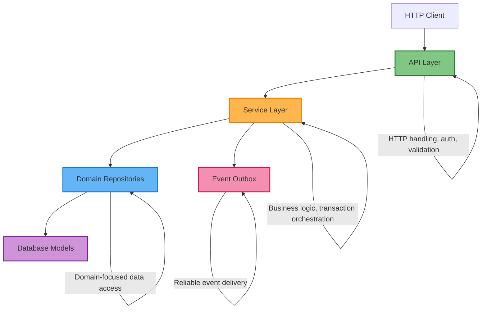
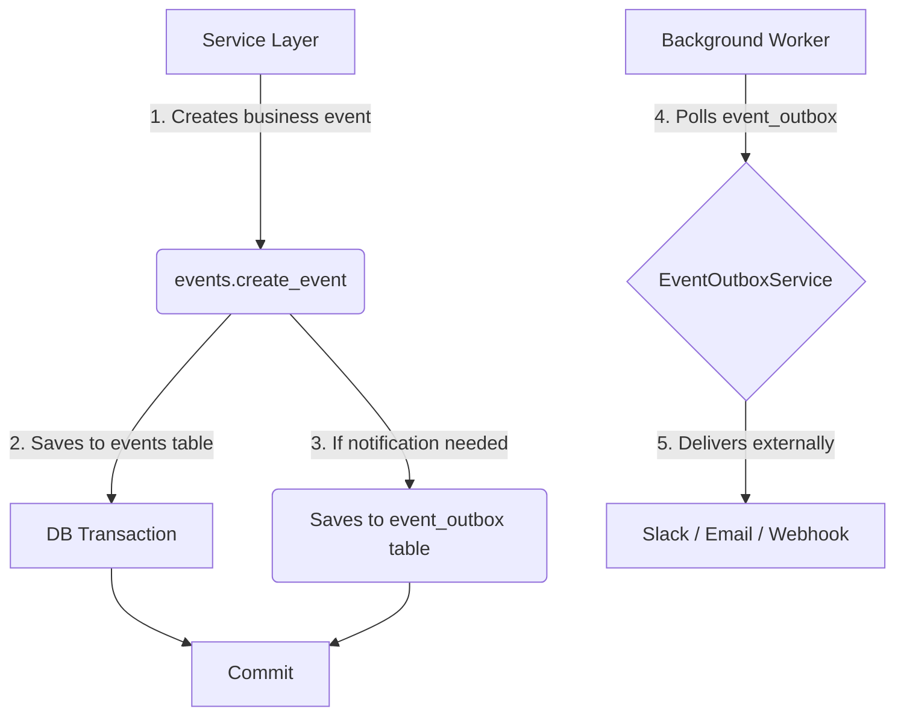

# Service Layer Architecture

## Overview

The Wriveted API uses a layered architecture with domain-oriented repositories, a service layer for business logic, and reliable event delivery via an outbox pattern. This document describes the **current implemented architecture** and remaining migration work.

### Layer Responsibilities



**Key services** (all implemented and active):

| Service | File | Role |
|---------|------|------|
| `AnalyticsService` | `app/services/analytics.py` | Read-only analytics and reporting |
| `CMSWorkflowService` | `app/services/cms_workflow.py` | CMS publishing, bulk ops, validation |
| `ConversationService` | `app/services/conversation_service.py` | Chat session lifecycle management |
| `FlowService` | `app/services/flow_service.py` | Flow CRUD, node/connection management |
| `CollectionService` | `app/services/collection_service.py` | Library collection operations |
| `BookListService` | `app/services/booklist_service.py` | Booklist management |
| `ConcurrencyControlService` | `app/services/concurrency_service.py` | Advisory locks, revision control |
| `EventOutboxService` | `app/services/event_outbox_service.py` | Reliable event delivery with retry |
| `ExecutionTraceService` | `app/services/execution_trace.py` | Chat flow execution tracing |
| `FlowWebhookService` | `app/services/flow_webhook_service.py` | Webhook delivery for flow events |
| `SlackNotificationService` | `app/services/slack_notification.py` | Slack alerts via event outbox |
| `EmailNotificationService` | `app/services/email_notification.py` | Email via event outbox |
| `CloudTasksService` | `app/services/cloud_tasks.py` | GCP Cloud Tasks integration |

---

## Domain Repository Architecture

### Repository Pattern

All data access goes through domain-oriented repositories in `app/repositories/`. Each repository defines an abstract interface (ABC) and a concrete SQL implementation.

**Current repositories** (20 files in `app/repositories/`):

| Repository | Domain |
|-----------|--------|
| `AuthorRepository` | Authors |
| `BooklistRepository` | Booklists |
| `ChatRepository` | Chat sessions and interactions |
| `ClassGroupRepository` | Class groups |
| `CMSRepository` | CMS content and variants |
| `CollectionRepository` | Library collections |
| `CollectionItemActivityRepository` | Collection item tracking |
| `ConversationRepository` | Conversation sessions |
| `EditionRepository` | Book editions |
| `EventRepository` | Application events |
| `FlowRepository` | Flow definitions, nodes, connections |
| `IllustratorRepository` | Illustrators |
| `LabelsetRepository` | Book label sets |
| `ProductRepository` | Stripe products |
| `SchoolRepository` | Schools |
| `ServiceAccountRepository` | Service account tokens |
| `SubscriptionRepository` | Stripe subscriptions |
| `WorkRepository` | Book works |

Protocol interfaces are defined in `app/repositories/protocols.py`.

### Remaining Legacy CRUD

Four CRUD files remain in `app/crud/`:

| File | Lines | Status |
|------|-------|--------|
| `base.py` | 283 | Base class + utilities (kept for shared helpers) |
| `cms.py` | 1346 | Active — delegates to CMSRepository for some ops |
| `collection.py` | 210 | Active — 26 usages across 9 files |
| `event.py` | 151 | Active — 49 usages across 16 files |
| `user.py` | 337 | Legacy — 86 usages across 20 files, most complex domain |

The `crud/__init__.py` re-exports `ChatRepository` from `app/repositories/` for backward compatibility.

---

## Declarative Database Infrastructure

All PostgreSQL functions and triggers are defined as Python objects using `alembic_utils`, providing version control and a single source of truth for database logic.

**Key files:**
- `app/db/functions.py` — PGFunction definitions
- `app/db/triggers.py` — PGTrigger definitions

**Example** (CMS full-text search trigger):

```python
# app/db/functions.py
cms_content_tsvector_update = PGFunction(
    schema="public",
    signature="cms_content_tsvector_update()",
    definition="""returns trigger LANGUAGE plpgsql
      AS $function$
        BEGIN
            NEW.search_document := to_tsvector(
                'english',
                coalesce(NEW.content->>'text','') || ' ' ||
                coalesce(NEW.content->>'setup','') || ' ' ||
                coalesce(NEW.content->>'question','') || ' ' ||
                coalesce(array_to_string(NEW.tags, ' '), '')
            );
            RETURN NEW;
        END;
      $function$
    """
)

# app/db/triggers.py
cms_content_tsvector_trigger = PGTrigger(
    schema="public",
    signature="trg_cms_content_tsvector_update",
    on_entity="public.cms_content",
    is_constraint=False,
    definition=(
        "BEFORE INSERT OR UPDATE ON public.cms_content FOR EACH ROW EXECUTE FUNCTION "
        f"{cms_content_tsvector_update.signature}"
    )
)
```

**Current implementations:**

| Object | Purpose | Status |
|--------|---------|--------|
| `cms_content_tsvector_update` | Full-text search maintenance | Live |
| `notify_flow_event` | Event notifications via NOTIFY | Live |
| `update_edition_title` | Computed field updates | Live |
| `update_edition_title_from_work` | Cascading title updates | Live |
| `update_collections_function` | Collection aggregation | Live |
| `cms_content_tsvector_trigger` | FTS trigger on `cms_content` | Live |
| `conversation_sessions_notify_flow_event_trigger` | Event trigger on sessions | Live |
| `update_collections_trigger` | Collection update trigger | Live |

Migrations use `op.create_entity()` / `op.drop_entity()` for these objects.

---

## Event Systems

The codebase has **three distinct event systems** serving different purposes:



### 1. Application Events (Original)

- **Files**: `app/crud/event.py`, `app/services/events.py`, `app/models/event.py`
- **Purpose**: User activity tracking, monitoring, Slack alerts
- **Storage**: `events` table
- **Delivery**: Direct Slack API calls, or via Event Outbox for reliability

### 2. Chat Flow Events (Real-time)

- **Files**: `app/services/event_listener.py`, database triggers (`notify_flow_event`)
- **Purpose**: Real-time chat session state changes for dashboard feedback
- **Mechanism**: PostgreSQL NOTIFY/LISTEN for immediate updates
- **Events**: `session_started`, `node_changed`, `session_completed`

### 3. Event Outbox (Reliable Delivery)

- **Files**: `app/models/event_outbox.py`, `app/services/event_outbox_service.py`
- **Purpose**: Guaranteed delivery to external systems with retry logic
- **Storage**: `event_outbox` table with status tracking, retry count, dead letter queue
- **Delivery**: Background processing with exponential backoff
- **Channels**: Webhook, Slack, email, internal processing
- **Usage**: Active in CMS, Flow, and Conversation domains

The Event Outbox writes happen within the same database transaction as business data, ensuring atomicity. NOTIFY/LISTEN is preserved for low-latency dashboard updates where durability is not critical.

---

## Concurrency Control

Session state modifications use PostgreSQL advisory locks combined with revision control to prevent lost updates.

**Problem**: Multiple writers (user API requests, background timeouts, webhook callbacks) can race on the same session.

**Solution** (implemented in `app/services/concurrency_service.py`):

1. **Per-session advisory locks**: `pg_try_advisory_xact_lock(hash(session_id))` scopes locks to individual sessions
2. **Revision control**: Every mutation increments a revision number; updates include `WHERE revision = :expected` to detect conflicts
3. **Conflict resolution**: User interactions retry once on conflict; background tasks abort gracefully

---

## Flow Storage Strategy

- **Canonical source**: Normalized tables (`flow_nodes`, `flow_connections`) are the system of record, used by runtime and analytics.
- **JSON snapshot**: `flow_definitions.flow_data` stores an import/export-friendly snapshot (nodes, connections, variables). Services regenerate this after structural edits for API responses and caching.
- **Importing**: API accepts `flow_data` on creation and materializes into normalized tables (with safe enum mapping; unknown connection types fall back to `DEFAULT` while preserving conditions).
- **Publishing**: Updates the published version and snapshots the current `flow_data`.

---

## Transactions & Events

- **Ownership**: Services own transaction boundaries. Repositories persist and flush; they do not commit.
- **Pattern**: For each write operation, the service coordinates repository writes, publishes an outbox event, then commits once.
- **Outbox**: `EventOutboxService.publish_event` enqueues events within the same SQLAlchemy session so the commit includes both business data and the event row.
- **Snapshots**: Snapshot materialization/regeneration is orchestrated by services to keep repositories side-effect free; builders perform `flush` only.

### Flow Service

- `FlowService` is the canonical write/read surface for flow operations (create/update/clone/publish, node and connection CRUD).
- All flow node/connection endpoints route through `FlowService`.
- Snapshot regeneration is handled via a dedicated builder and regeneration endpoint/CLI, not per-operation auto-regeneration.

---

## Migration Status

### Completed

- **Repository migration**: 15 of 16 domains have repository implementations (94%)
- **CRUD removal**: 12 domain CRUD files deleted (75%)
- **Service layer**: 4 core services (Analytics, CMS, Conversation, Flow) implementing domain-focused patterns
- **Declarative DB**: All new database objects use `alembic_utils`
- **Full-text search**: PostgreSQL tsvector/GIN indexes for CMS content
- **Event Outbox**: Production-ready reliable delivery
- **Concurrency control**: Advisory locks with revision control
- **Test isolation**: Singleton reset infrastructure, CSRF isolation, 638+ integration tests passing

### Remaining Work

| Item | Effort | Notes |
|------|--------|-------|
| **User domain migration** | High | 337-line CRUD, 86 usages across 20 files, polymorphic user types |
| **Collection CRUD removal** | Medium | 26 active usages across 9 files |
| **Event CRUD removal** | Medium | 49 active usages across 16 files |
| **API layer migration** | Ongoing | ~16 API files still import from `app.crud`; CMS, analytics, and chat endpoints already use services |
| **Unit of Work adoption** | Low | `app/services/unit_of_work.py` is implemented but unused; services manage transactions manually |
| **Service unit tests** | Medium | Most service files lack dedicated unit tests (tested indirectly via integration tests) |

### Migration Workflow

When migrating a domain from CRUD to repository pattern:

1. **Analyze** the existing CRUD file (operations, method signatures, dependencies)
2. **Create repository** in `app/repositories/{domain}_repository.py` with ABC interface + SQL implementation
3. **Update consumers** to import from the new repository instead of `app.crud.{domain}`
4. **Handle circular imports** using one of three proven patterns:
   - Replace CRUD imports with repository imports
   - Extract shared utilities to `app/utils/` (e.g., `dict_utils.py`)
   - Use function-level local imports
5. **Delete the CRUD file** once all consumers are migrated
6. **Run full test suite** via `bash scripts/integration-tests.sh`

---

## Design Principles

These principles guide architectural decisions:

1. **Single Responsibility**: Each service handles one domain
2. **Dependency Injection**: Services receive dependencies via constructor
3. **Domain Exceptions**: Services raise domain-specific exceptions, never HTTP status codes
4. **Transaction Ownership**: Each public service method = one transaction boundary
5. **CQRS-Lite**: Write services coordinate transactions; read services (e.g., `AnalyticsService`) access repositories directly without transaction overhead
6. **Repository Focus**: Domain-oriented methods with clear business meaning, not generic query variations
7. **Testability**: Repository interfaces (ABC/Protocol) enable mocking for isolated unit tests
